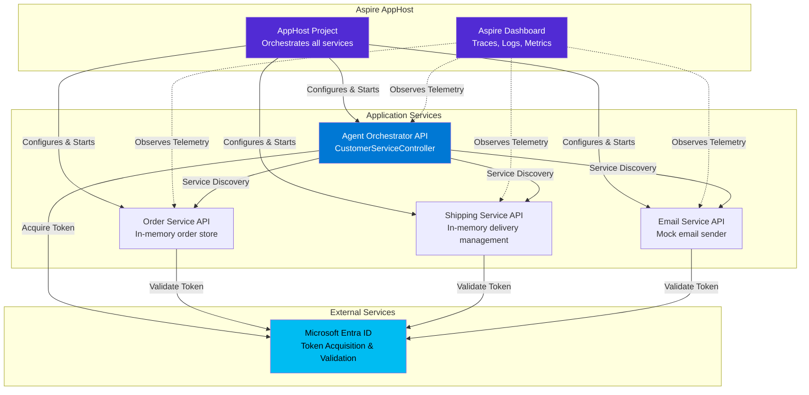

# Customer Service Agent Sample - Agent Identities with .NET Aspire

[](https://dot.net)
[](https://learn.microsoft.com/dotnet/aspire/)
[](https://github.com/AzureAD/microsoft-identity-web)

A comprehensive sample demonstrating how AI agents securely call downstream services using **Agent Identities** in Microsoft Entra ID. This Customer Service Orchestration Agent showcases realistic business scenarios where an agent orchestrates multiple downstream APIs using both autonomous agent identities and agent user identities, all with full observability via .NET Aspire.

## 🎯 Overview

This sample illustrates:
- **Autonomous Agent Identity** (Order API - read operations with app role-based access control)
- **Agent User Identities** with user context (Shipping & Email APIs - write operations)  
- **App Role-Based Authorization** - Order API accepts both delegated permissions (`Orders.Read`) and application permissions (`Orders.Read.All`)
- **.NET Aspire Dashboard** - Distributed tracing, logs, metrics, and service map
- **Service Discovery** - Dynamic service resolution via Aspire
- **In-Memory Stores** - Simple demonstration without external dependencies

## 🏗️ Architecture



## 🚀 Quick Start

### Prerequisites

- [.NET 9 SDK](https://dotnet.microsoft.com/download/dotnet/9.0)
- [Visual Studio 2022](https://visualstudio.microsoft.com/) or [VS Code](https://code.visualstudio.com/) with C# extension
- *(Optional)* [Microsoft 365 Developer account](https://developer.microsoft.com/microsoft-365/dev-program) for Graph API integration

### Run the Sample

1. **Clone the repository**
   ```bash
   git clone https://github.com/Azure-Samples/ms-identity-agent-identities.git
   cd ms-identity-agent-identities/dotnet/CustomerServiceAgent
   ```

2. **Build the solution**
   ```bash
   dotnet build
   ```

3. **Run with .NET Aspire**
   ```bash
   dotnet run --project src/CustomerServiceAgent.AppHost
   ```

4. **Access the Aspire Dashboard**
   - Open your browser to `https://localhost:15888` (or the URL shown in the console)
   - Explore the service map, traces, logs, and metrics

5. **Test the orchestration**
   ```bash
   # Using curl
   curl -X POST https://localhost:7000/api/customerservice/process \
     -H "Content-Type: application/json" \
     -d '{"orderId": "12345", "userUpn": "agent@contoso.com"}'
   
   # Or use the .http file in VS Code
   # Open: src/AgentOrchestrator/AgentOrchestrator.http
   ```

   Note that this endpoint is on purpose anonymous, so that you can more easily test things out. In production you would need to uncomment the [Authorize] attribute on the endpoint.

## 📁 Project Structure

```
CustomerServiceAgent/
├── README.md                              # This file
├── CustomerServiceAgent.sln               # Solution file
├── docs/
│   ├── lab-instructions.md                # 30-minute hands-on lab
│   ├── architecture.md                    # Deep dive architecture
│   ├── troubleshooting.md                 # Common issues & solutions
│   └── setup/
│       ├── 01-prerequisites.md
│       ├── 02-entra-id-setup.md
│       ├── 03-office365-dev-tenant.md
│       └── 04-appsettings-configuration.md
└── src/
    ├── CustomerServiceAgent.AppHost/      # Aspire orchestration
    ├── CustomerServiceAgent.ServiceDefaults/  # Shared Aspire config
    ├── AgentOrchestrator/                 # Main orchestrator service
    │   ├── Controllers/
    │   │   └── CustomerServiceController.cs
    │   ├── Services/
    │   │   └── OrchestrationService.cs    # Agent identity token acquisition
    │   └── appsettings.json
    ├── DownstreamServices/
    │   ├── OrderService/                  # Read operations (autonomous)
    │   ├── ShippingService/               # Write operations (agent user)
    │   └── EmailService/                  # Write operations (agent user)
    └── Shared/
        └── Models/                        # Common DTOs
```

## 🔑 Key Features

### 1. Autonomous Agent Identity with App Roles (Read Operations)
```csharp
// OrderService uses autonomous agent identity with app role-based access
var authHeader = await _authorizationHeaderProvider
    .CreateAuthorizationHeaderForAppAsync(
        $"api://YOUR_SERVICE_CLIENT_ID/.default",
        new AuthorizationHeaderProviderOptions().WithAgentIdentity(autonomousAgentId)
    );
```

The Order Service accepts tokens with the `Orders.Read.All` app role:
```csharp
// Custom authorization policy accepts both scopes and app roles
builder.Services.AddAuthorization(options =>
{
    options.AddPolicy("Orders.Read.Any", policy =>
        policy.RequireAssertion(ctx =>
            ctx.User.HasClaim(c => c.Type == "scp" && c.Value.Split(' ').Contains("Orders.Read")) ||
            ctx.User.HasClaim(c => c.Type == "roles" && c.Value.Split(' ').Contains("Orders.Read.All"))
        )
    );
});
```

### 2. Agent User Identity (Write Operations)
```csharp
// Shipping and Email services use agent user identity with user context
var authHeader = await _authorizationHeaderProvider
    .CreateAuthorizationHeaderForUserAsync(
        new[] { $"api://YOUR_SERVICE_CLIENT_ID/.default" },
        new AuthorizationHeaderProviderOptions().WithAgentUserIdentity(agentUserId, userUpn)
    );
```

### 3. Token Validation
```csharp
// All downstream services validate tokens
builder.Services.AddMicrosoftIdentityWebApiAuthentication(
    builder.Configuration, "AzureAd");
```

### 4. Distributed Tracing
All API calls are automatically traced and visible in the Aspire Dashboard.

## 📚 Documentation

- **[Lab Instructions](docs/lab-instructions.md)** - 30-minute hands-on lab
- **[Architecture Deep Dive](docs/architecture.md)** - Detailed design decisions
- **[Entra ID Setup](docs/setup/02-entra-id-setup.md)** - Configure agent identities
- **[Troubleshooting](docs/troubleshooting.md)** - Common issues and solutions

## 🔧 Configuration

### Production Mode (Azure AD)
To enable real Agent Identities:

1. **Register the downstream APIs in Azure AD** (see [Entra ID Setup](docs/setup/02-entra-id-setup.md))
2. **Create Agent Identity Blueprint** in your tenant
3. **Update appsettings.json** with your tenant and client IDs
4. **Configure Program.cs** to use real Microsoft Identity Web services

## 🧪 Testing Scenarios

### Scenario 1: Agent Identity
```json
POST /api/customerservice/process
{
  "orderId": "12345",
  "agentIdentity": "YOUR_AGENT_IDENTITY_ID"
}
```
**Expected:** Order retrieved using agent identity.

### Scenario 2: Full Orchestration (Agent User Identity)
```json
POST /api/customerservice/process
{
  "orderId": "12345",
  "userUpn": "agent@contoso.com",
  "agentIdentity": "YOUR_AGENT_USER_ID"
}
```
**Expected:** All operations complete, including shipping update and email notification using agent user identity.

## 📊 Observability

The Aspire Dashboard (`https://localhost:15888`) provides:
- **Traces** - End-to-end request flows across services
- **Logs** - Aggregated logs from all services with filtering
- **Metrics** - HTTP request rates, durations, error rates
- **Service Map** - Visual representation of service dependencies
- **Health Checks** - Real-time service health status

## 🌟 What's Next?

- **[Add Microsoft Graph integration](docs/setup/03-office365-dev-tenant.md)** - Send Teams messages and emails
- **Deploy to Azure** - Use Azure Container Apps with Aspire
- **Add resilience patterns** - Implement retry policies and circuit breakers
- **Expand agent scenarios** - Add more autonomous vs. user-delegated patterns

## 📖 Resources

- [Agent Identities Documentation](https://github.com/AzureAD/microsoft-identity-web/blob/main/src/Microsoft.Identity.Web.AgentIdentities/README.AgentIdentities.md)
- [.NET Aspire Documentation](https://learn.microsoft.com/dotnet/aspire/)
- [Microsoft Graph SDK](https://learn.microsoft.com/graph/sdks/sdks-overview)
- [Microsoft Identity Web](https://github.com/AzureAD/microsoft-identity-web)

## 🤝 Contributing

This project welcomes contributions. Please see [CONTRIBUTING.md](../../CONTRIBUTING.md) for guidelines.

## ⚖️ License

This project is licensed under the MIT License - see the [LICENSE.md](../../LICENSE.md) file for details.

---

**Target:** Microsoft Ignite 2025 (November)  
**Duration:** 30-minute hands-on lab  
**Audience:** Enterprise developers building AI agent solutions
